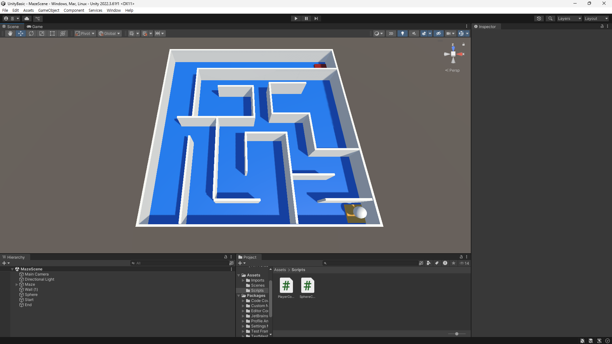

# 유니티 입문
## 인터페이스 구성
### 하이어라키 (Hierarchy)
게임 공간상에 배치되는 오브젝트들에 대한 목록과 계층 구조(상속 관계)를 표시한다
### 프로젝트 (Project)
해당 프로젝트 내에서 사용하는 모든 파일과 에셋이 표시된다  
유니티 프로젝트에 파일을 추가할 때는 반드시 유니티 에디터의 프로젝트창에서 추가하도록 한다
### 콘솔 (Console)
에디터 운용 / 테스트 진행 중 발생하는 모든 로그 및 에러의 이력을 확인할 수 있다
### 씬뷰 (SceneView)
게임 내 공간을 개발자가 시각적으로 탐색하고 편집할 수 있는 공간
### 게임뷰 (GameView)
Run(실행)시 실제로 게임 화면으로 렌더링 되는 화면
게임 내의 카메라를 통해 렌더링 된다다
### 인스펙터 (Inspector)
선택 된 오브젝트에 대한 정보를 보고 편집할 수 있다  
오브젝트에 추가된 기능에 따라 다양한 설정 메뉴들이 있다
### 툴바 - 레이어 메뉴 (Layer Menu)
에디터 내에서 레이어가 설정된 오브젝트에 대한 가시여부 설정이 가능
실제 빌드에선 적용되지 않습니다.
### 툴바 - 레이아웃 메뉴 (Layout Menu)
화면의 인터페이스를 미리 설정된 레이아웃대로 변경할 수 있다
### 툴바 - 플레이 모드 (Play Mode)
게임의 플레이테스트를 진행합니다.
왼쪽부터 Run(Play), 일시정지, 1프레임 넘기기가 가능
## 컴포넌트 (Component)
특정한 기능을 수행할 수 있도록 구성한 작은 기능적 단위
게임오브젝트의 작동과 관련한 부품
게임오브젝트에 추가, 삭제하는 방식의 조립형 부품
### 유니티의 대표적인 함수들
```cs
private void Awake()
{
    // 스크립트가 씬에 포함되었을 때 1회 호출
    // 스크립트가 비활성화 되어 있는 경우에도 호출됨

    // 역할 : 스크립트가 필요로 하는 초기화 작업 진행
    //        (외부 게임상황과 무관한 초기화 작업)

    Debug.Log("Awake");
}
private void Start()
{
    // 스크립트가 씬에 처음으로 Update하기 직전에 1회 호출
    // 스크립트가 비활성화 되어 있는 경우 호출되지 않음

    // 역할 : 스크립트가 필요로 하는 초기화 작업 진행
    //        (외부 게임상황이 필요한 초기화 작업)

    Debug.Log("Start");
}

private void OnEnable()
{
    // 스크립트가 활성화될 때마다 호출

    // 역할 : 스크립트가 활성화 되었을 때 작업 진행

    Debug.Log("OnEnable");
}

private void OnDisable()
{
    // 스크립트가 비활성화될 때마다 호출

    // 역할 : 스크립트가 비활성화 되었을 때 작업 진행

    Debug.Log("OnDisable");
}

private void Update()
{
    // 게임의 프레임 처음마다 호출

    // 역할 : 핵심 게임 로직 구현
}

private void LateUpdate()
{
    // 게임의 프레임 마지막마다 호출
    // 씬의 모든 게임오브젝트의 Update가 진행된 후 호출

    // 역할 : 게임프레임의 진행 결과가 필요한 동작이 있는 기능 구현

    Debug.Log("LateUpdate");
}

private void FixedUpdate()
{
    // 일정한 시간(기본 1초에 50번) 마다 호출
    // Update와 다르게 프레임당 연산과 단위시간이 일정
    // 물리엔진과 같이 게임의 프레임과 무관하게 일정해야 하는 작업에 사용
    // 게임로직 등 연산이 많은 작업을 FixedUpdate에 구현하지 않아야 함

    // 역할 : 물리엔진 작업 진행

    Debug.Log("FixedUdpate");
}

private void OnDestroy()
{
    // 스크립트가 씬에서 삭제되었을 때 1회 호출

    // 역할 : 스크립트가 필요로 하는 마무리 작업 진행

    Debug.Log("OnDestroy");
}
```
## 미로와 굴러가는공 구현

구체 컨트롤 스크립트
```cs
public class SphereContoller : MonoBehaviour
{
    [Header("Value")]
    public Rigidbody rigid;
    public float movePower = 5f;

    private void Awake()
    {
        rigid = GetComponent<Rigidbody>();
    }

    private void Update()
    {
        if (Input.GetKey(KeyCode.A))
        {
            rigid.AddForce(Vector3.left * movePower, ForceMode.Force);
        }
        if (Input.GetKey(KeyCode.D))
        {
            rigid.AddForce(Vector3.right * movePower, ForceMode.Force);
        }
        if (Input.GetKey(KeyCode.W))
        {
            rigid.AddForce(Vector3.forward * movePower, ForceMode.Force);
        }
        if (Input.GetKey(KeyCode.S))
        {
            rigid.AddForce(Vector3.back * movePower, ForceMode.Force);
        }
    }
}
```